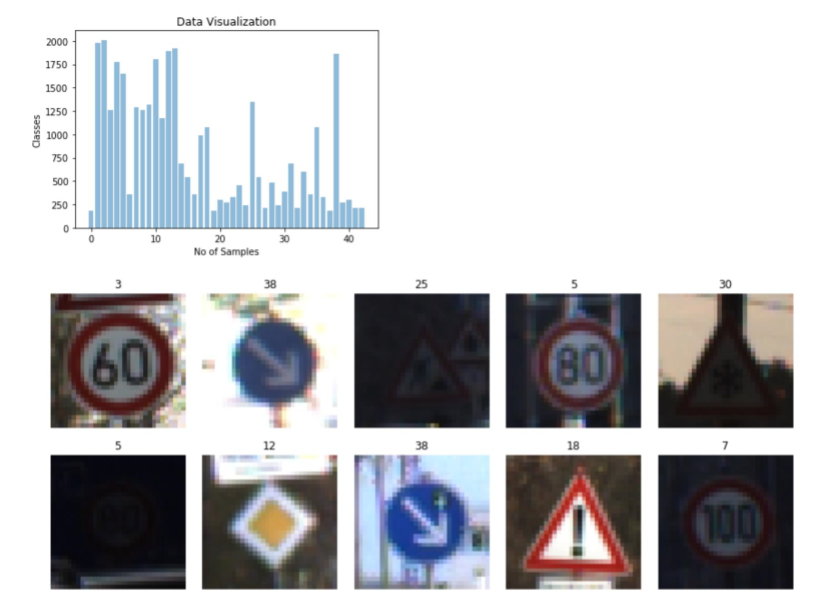
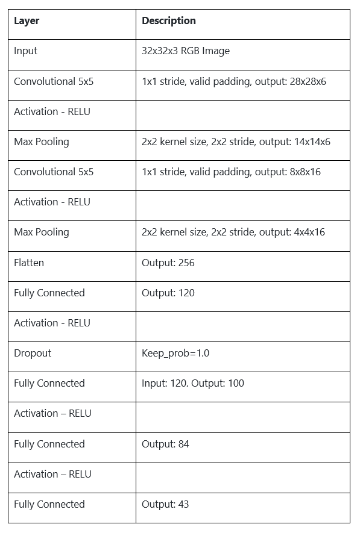
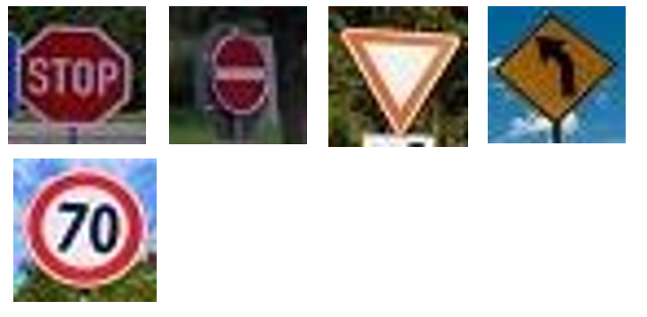
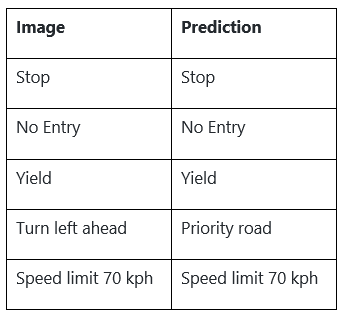
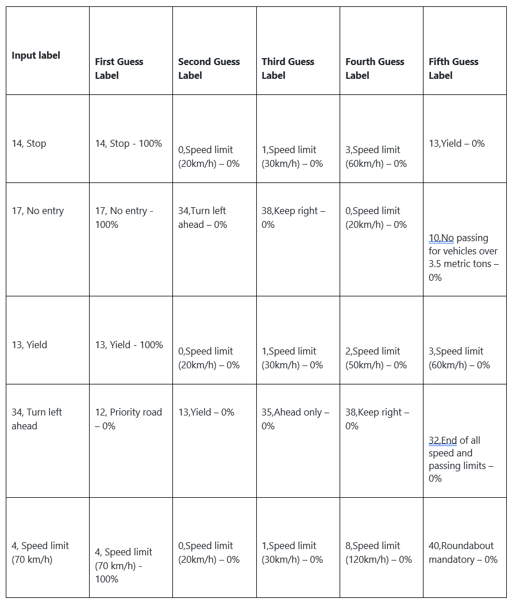

# Traffic Sign Recognition 

**Build a Traffic Sign Recognition Project** 
The goals / steps of this project are the following: 
• Load the data set (see below for links to the project data set) 
• Explore, summarize and visualize the data set 
• Design, train and test a model architecture 
• Use the model to make predictions on new images 
• Analyze the softmax probabilities of the new images 
• Summarize the results with a written report 

The project code is submitted [here]([https://github.com/efimiap/CarND-TrafficSignClassifier-P2/blob/master/Traffic_Sign_Classifier.ipynb](https://github.com/efimiap/CarND-TrafficSignClassifier-P2/blob/master/Traffic_Sign_Classifier.ipynb))

### Data Set Summary & Exploration

 **1**.  **Provide a basic summary of the data set. In the code, the analysis should be done using python, numpy and/or pandas methods rather than hardcoding results manually.** 
I used the numpy library to calculate summary statistics of the traffic signs data set. The results were the following: 
• Number of training examples = 34799
• Number of validation examples = 4410 
• Number of testing examples = 12630 
• Image data shape = (32, 32, 3) 
• Number of classes = 43 

**2.  Include an exploratory visualization of the dataset.** 
Here is an exploratory visualization of the data set.  I have included a random selection of images from the training dataset and the labels assigned to each of them (classification). As a follow up, I have included a bar chart showing how the training data are being distributed in the classes. The graph axles have the Number of Samples and the Classes. 

 

**3. Describe how you preprocessed the image data. What techniques were chosen and why did you choose these techniques? Consider including images showing the output of each preprocessing technique. Preprocessing refers to techniques such as converting to grayscale, normalization, etc. (OPTIONAL: As described in the "Stand Out Suggestions" part of the rubric, if you generated additional data for training, describe why you decided to generate additional data, how you generated the data, and provide example images of the additional data. Then describe the characteristics of the augmented training set like number of images in the set, number of images for each class, etc.)**
As a first step, I decided to convert the images to grayscale because it is not expensive computationally and reduces significantly the computational time. Further on, I decided not to use this conversion as there was not a difference on the up time or the process of the training.   

As a follow up, I normalized the image data as this technique helps the network converge. The output of the normalized data is around 1.2   

• X_train_normalized = 1.2192509993922922 
• X_test_normalized = 1.2187986942229847 
• X_valid_normalized = 1.2106115564647626 

**2. Describe what your final model architecture looks like including model type, layers, layer sizes, connectivity, etc.) Consider including a diagram and/or table describing the final model.** 
My final model consisted of the following layers: 

 

**3. Describe how you trained your model. The discussion can include the type of optimizer, the batch size, number of epochs and any hyperparameters such as learning rate.** 
To train the model, I used the following parameters: 
• Epochs: 55 
• Batch size: 128 
• mu: 0 
• sigma: 0.1 
• Learning rate: 0.001 
• AdamOptimizer 

**4. Describe the approach taken for finding a solution and getting the validation set accuracy to be at least 0.93. Include in the discussion the results on the training, validation and test sets and where in the code these were calculated. Your approach may have been an iterative process, in which case, outline the steps you took to get to the final solution and why you chose those steps. Perhaps your solution involved an already well known implementation or architecture. In this case, discuss why you think the architecture is suitable for the current problem.** 
My final model results were: 
	• **validation set accuracy:** 0.938 
	• **test set accuracy** of 0.938 

• At first, I tried the LeNet Architecture approach, but the resulted validation accuracy was between 88.9 – 90 % and needed a great number of alterations in order to achieve accuracy beyond 93%. 
• The most obvious issue with LeNet was that it was taking (32x32x1) images as input and returned 10 classes. On our assignment we are using (32x32x3) images (3-channels instead of 1) and we need to output 43 classes. 
• In order to adjust the LeNet Architecture I performed a series of random experiments using the “trial and error” approach. I was adding layers (convolutional, max pooling and fully connected) and kept on trying to reduce the initial output size. By changing also the learning rate and the epochs I was experimenting with overfitting and underfitting until I finally achieved something beyond 0.93 accuracy. 
• Initially I was achieving around 0.92 accuracy with 35 epochs, so I decided to increase the epochs to 55 and finally achieved 0.938 accuracy. 
• The most important choices made were the increase of epochs and the pooling after the first convolutional, as it allowed me to reduce the initial size from 32x32 to 14x14.

### Test the Model on New Images  
**1. Choose five German traffic signs found on the web and provide them in the report. For each image, discuss what quality or qualities might be difficult to classify.** 
Here are five German traffic signs that I found on the web:

 

I changed the size of the images to W, H = 32, 32 so they can be used for the evaluation. Labels respectively: [14, 17, 13, 34, 4]  
 The “No entry” sign is a bit shifted on the right, making the outside circle not easy to detect. The “turn left ahead” sign can be considered as an outlier since it is not included on the dataset and should not be detected as a sign. I added it there to see the behavior of the network. The “Yield” sign is a bit shifted and the colors are wrong (orange instead of red) which could affect the performance of the network. By keeping the colors of the images and using greyscale when training and evaluating, it increases the risk of network failure. The rest of the images where quite clear and easy to detect. 

**2. Discuss the model's predictions on these new traffic signs and compare the results to predicting on the test set. At a minimum, discuss what the predictions were, the accuracy on these new predictions, and compare the accuracy to the accuracy on the test set (OPTIONAL: Discuss the results in more detail as described in the "Stand Out Suggestions" part of the rubric).** 
Here are the results of the prediction:

 

The model was able to correctly guess 4 of the 5 traffic signs, which gives an accuracy of 80%.

**3. Describe how certain the model is when predicting on each of the five new images by looking at the softmax probabilities for each prediction. Provide the top 5 softmax probabilities for each image along with the sign type of each probability. (OPTIONAL: as described in the "Stand Out Suggestions" part of the rubric, visualizations can also be provided such as bar charts)**

 

